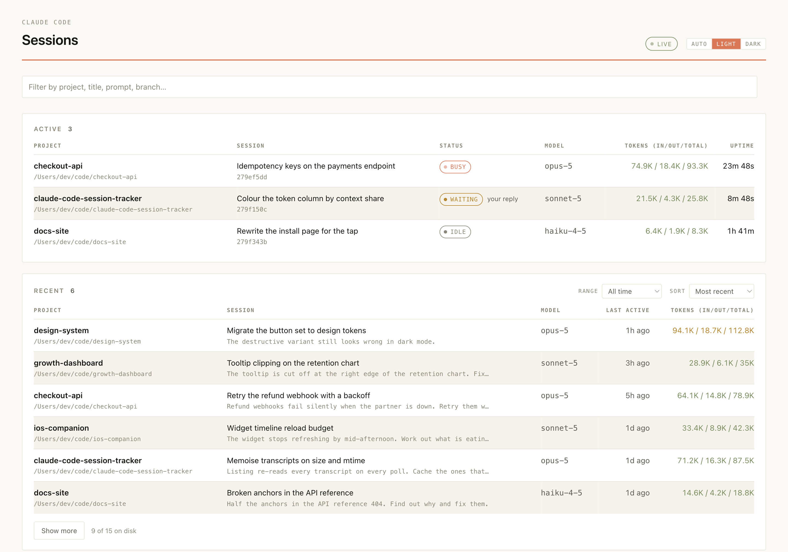
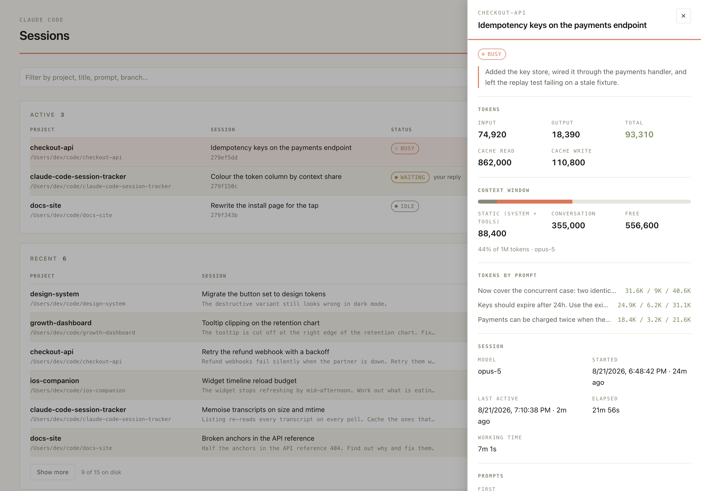

# Claude Code Session Tracker

[](https://github.com/meyusufdemirci/claude-code-session-tracker/actions/workflows/ci.yml)
[](https://www.npmjs.com/package/claude-code-session-tracker)
[](https://nodejs.org)
[](./LICENSE)

See every Claude Code session on your machine in a local dashboard — grouped by
project, with live status, titles, and token usage.

<picture>
  <source media="(prefers-color-scheme: dark)" srcset="docs/dashboard-dark.png" />
  
</picture>

```sh
npx claude-code-session-tracker
```

Or install it for good, if you would rather have it on your `PATH`:

```sh
brew install meyusufdemirci/tap/claude-code-session-tracker
```

Then open the printed `http://127.0.0.1:3099`.

Run Claude Code in four terminals and you lose track of which one is waiting on
you, which is still working, and what you asked the one you abandoned yesterday.
Claude Code already writes all of that to `~/.claude`. This reads it — nothing
else — and puts it on one page.

## What you get

- **Your limits**, at the top: two cards, one for the five-hour window Claude
  Code calls a session limit and one for the seven-day window it calls a weekly
  limit — how much of each you have spent, when it resets, where it lands if you
  keep going at the rate you have kept, and how that compares with the heaviest
  window you have already put through.
- **Active sessions**, checked twice against the OS so a stale file or a
  recycled PID never shows up as running.
- **Recent sessions** across every project, with Claude's own title, the first
  and last prompt, the model, and the branch — narrowed to today, yesterday, the
  last 3, 7 or 30 days, or a date range of your own, and ordered by recency or by
  token spend.
- **A detail panel** per session: message and tool-call counts, token totals,
  elapsed and working time, subagent count, a copyable `claude --resume <id>`,
  and a button that shows the transcript in your file manager.
- **`--json`** for scripting, and an HTTP API if you would rather build your own.
- **No dependencies, no install scripts, no network calls, no writes** to your
  Claude directory.

Click a row and the panel opens beside it:

<picture>
  <source media="(prefers-color-scheme: dark)" srcset="docs/session-detail-dark.png" />
  
</picture>

## Requirements

Node 20 or newer, and Claude Code having run at least once on this machine.
macOS, Linux, and Windows are all covered by CI. Nothing else is needed —
if `~/.claude` does not exist yet, the page says so and fills in the moment
your first session starts.

## Run it with any package manager

```sh
npx      claude-code-session-tracker   # npm
pnpm dlx claude-code-session-tracker   # pnpm
yarn dlx claude-code-session-tracker   # yarn
bunx     claude-code-session-tracker   # bun
```

The package has **no runtime dependencies** and no install scripts, so every
runner behaves the same.

## Or install it

```sh
brew install meyusufdemirci/tap/claude-code-session-tracker
claude-code-session-tracker
```

The formula installs the same npm tarball the commands above download, so the
two are the same program — it just lives on your `PATH` and updates with
`brew upgrade` instead of being fetched each time. Homebrew's own `node` comes
with it, which is why this is the one route that does not need Node already
installed.

Elsewhere, `npm i -g claude-code-session-tracker` (or the `pnpm add -g` /
`bun add -g` equivalent) does the same job.

## Options

| Flag | Description |
| --- | --- |
| `-p, --port <number>` | Port to listen on, stepping forward up to 20 times if taken (default `3099`) |
| `--host <address>` | Address to bind (default `127.0.0.1` — see the warning below) |
| `--no-open` | Do not open a browser |
| `--json` | Print the session list as JSON and exit |
| `-n, --limit <number>` | How many sessions to list (default `50`; running ones are always shown) |
| `--claude-dir <path>` | Override the Claude data directory |
| `-h, --help` | Show usage |
| `-v, --version` | Show the version |

## Scripting

`--json` prints the same payload the page uses, then exits:

```sh
npx claude-code-session-tracker --json | jq '.sessions[] | .project.name'
```

```jsonc
{
  "sessions": [
    {
      "id": "279ed6ae-49fd-4234-a74e-145f5535341c",
      "source": "claude-code",
      "status": "busy",              // busy · waiting · idle · ended
      "project": { "name": "…", "path": "…", "slug": "…", "gitBranch": "main" },
      "title": "Disable dependabot", // Claude's own title, when it wrote one
      "firstPrompt": "…",
      "lastPrompt": "…",
      "model": "claude-sonnet-5",
      "version": "2.1.235",          // the Claude Code that wrote the session
      "startedAt": 1787142489923,
      "lastActiveAt": 1787142700231,
      "transcriptPath": "…/279ed6ae….jsonl",
      "sizeBytes": 136133,
      "live": { "pid": 4129, "kind": "interactive", "entrypoint": "cli" }
    }
  ],
  "sources": [ /* one entry per adapter, with whether it found its data */ ],
  "total": 794,
  "generatedAt": 1787142701002
}
```

Only running sessions carry `live`. Everything else is optional — a field that
was not in the transcript is absent rather than null.

## HTTP API

The server is the same one the page talks to, so anything the page can do you
can do with `curl`:

| Route | Returns |
| --- | --- |
| `GET /api/sessions?limit=N` | The list above. `limit` matches `--limit`, and running sessions are always included |
| `GET /api/sessions?since=&until=` | The same list, narrowed to transcripts last written in that window. Epoch milliseconds; `since` is inclusive, `until` exclusive; either may be left off. Running sessions ignore it |
| `GET /api/sessions?sort=` | `recent` (the default), `tokens-desc`, or `tokens-asc`. Ranks the finished sessions across the whole window, not just the page. An unknown value falls back to `recent` |
| `GET /api/sessions/:id` | One session with `counts`, `tokens`, `models`, `activeMs`, `awaySummary`, and `notes` |
| `GET /api/limits` | Both limits, as `session` (five hours) and `weekly` (seven days). Each carries `windowMs`, `clock`, `historyDays`, the `current` window, the heaviest closed one as `reference`, and `lastLimited` if Claude ever cut one short. 404 when no source can measure them |
| `GET /api/health` | `ok`, the version, the Node it runs on, the resolved Claude directory, and per-source status |
| `POST /api/sessions/:id/reveal` | Shows that transcript in your file manager. Requires a loopback `Origin` |

Every route refuses a request whose `Host` is not loopback. `reveal` is the only
one that acts rather than reports, so it is a POST, it checks `Origin` as well,
and the path it opens comes from our own lookup — never from the request.

## The limits

Claude Code bills against two clocks: a five-hour window it calls a session
limit, and a seven-day one it calls a weekly limit. Neither quota is written to
disk — both are enforced server-side and the only trace either leaves in a
transcript is the turn it refused — so both cards at the top of the page are
**measured, not read**:

- **The five-hour window** is chained from the turn timestamps. It opens on your
  first billed turn after the last one emptied and runs five hours from there,
  floored to the half hour, which is where Claude puts it: on the one refusal
  this was calibrated against, a first turn at 08:37 reset at 13:30. When Claude
  *has* refused a turn, its own `resetsAt` is used instead of ours.
- **The week** cannot be chained the same way — nobody goes seven quiet days, so
  there is no gap to read a week's edge off. Claude writes its weekly clock down
  in exactly one place: a weekly refusal. With one of those in your history the
  weeks are pinned to it and stepped forward in sevens; without one the card
  counts the seven days behind you and says so rather than implying a reset
  nobody can read.
- **Used** is input, output and newly-cached tokens across every project — and
  every subagent, whose turns bill to the window that spawned them. Cache reads
  are shown apart: they cost a fraction as much and outweigh the rest roughly
  fifty to one, so folding them in would produce a number that tracks how long
  your conversations are rather than how much work you asked for.
- **Projected** is where the window in progress lands by its reset if it carries
  on at the rate it has kept so far. It is tinted on the bar's own scale, so a
  green bar beside a red projection is the card saying this window is calm now
  and will not stay that way — the one reading on it that looks forwards. It
  stays away until a fifth of the window has gone, since a rate read off the
  first few minutes projects noise, and stays away from a rolling week entirely:
  that one ends at the instant it is measured, leaving nothing to project into.
- **The share** is against the heaviest window that has already closed — the last
  7 days for the five-hour card, the last 28 for the weekly one — never the one
  in progress, since a window is always 100% of itself. It is a yardstick, not a
  quota. If Claude has actually cut a window short, the note says which one and
  how big it was, because that is the one point on the scale it drew itself.

If nothing has run in a window there is none, and the card says so rather than
showing an empty bar.

## On the page

Click any row for the full read. Everything has a key:

| Key | Does |
| --- | --- |
| <kbd>/</kbd> | Jump to the filter |
| <kbd>↑</kbd> <kbd>↓</kbd> | Move between sessions, across both tables |
| <kbd>Home</kbd> <kbd>End</kbd> | First and last session |
| <kbd>↵</kbd> | Open the selected session |
| <kbd>Esc</kbd> | Close the panel, or clear the filter |

The list refreshes every 2 seconds and says so when the server goes away. The
page takes the same limit from the query string, so `?limit=200` and
`--limit 200` show the same depth of history.

**Range** and **Sort** above the Recent table narrow it to a stretch of history and
order it by recency or by token spend. Both go into the query string alongside the
limit — `?range=7d&sort=tokens-desc`, or `?range=custom&from=2026-08-01&to=2026-08-14`
— so a reload comes back to the same view, and a bookmark keeps it. Ranges are whole
local days, so "today" means since midnight rather than the last 24 hours. **Reset**
appears beside them once either is off its default and puts both back; it leaves the
text filter and how far you have paged alone. Neither control touches the Active
table: a running session is shown whatever window is on screen.

The theme follows your OS by default; **Auto / Light / Dark** in the top right
overrides it, and the choice is remembered.

## What it reads

Everything comes from what Claude Code already writes to disk:

| Path | Used for |
| --- | --- |
| `~/.claude/sessions/<pid>.json` | Running sessions and their live status |
| `<session cwd>/.git/HEAD` | The branch a running session is on |
| `~/.claude/projects/**/*.jsonl` | Session history — titles, prompts, models, branch |
| `~/.claude/projects/*/*/subagents/agent-*.jsonl` | Subagent turns, for the limit windows they bill to |
| `~/.claude.json` | Per-project rollup metrics *(not read yet)* |

Set `CLAUDE_CONFIG_DIR` (or pass `--claude-dir`) if your Claude data lives
somewhere other than `~/.claude`. Some Claude Code versions accept a
comma-separated list there; the first entry wins.

## Privacy

**The tool never writes to the Claude directory**, binds to loopback only,
rejects requests that are not addressed to a loopback host, and makes no
outbound network calls of any kind. There is no telemetry and no update check.

Transcripts hold your prompts, your paths, and sometimes your secrets. That is why
the default bind is `127.0.0.1` and why every request has to be addressed to a
loopback host — a page on any website can otherwise point a browser at your
`localhost`. Passing `--host` to something else drops that guard, so the CLI says
so, loudly, before it starts.

For a machine you are SSH'd into, forward the port instead of opening the bind:

```sh
ssh -L 3099:127.0.0.1:3099 you@the-machine
```

## Troubleshooting

**Nothing is listed.** Check `curl -s 127.0.0.1:3099/api/health` — it prints the
directory that was searched. If that is not where your transcripts are, set
`CLAUDE_CONFIG_DIR` or pass `--claude-dir`.

**A session I just started is missing.** The list refreshes every 2 seconds and
a session appears once Claude Code has written its first record.

**A session shows as idle while it is clearly working.** Status comes from what
Claude Code itself records in `~/.claude/sessions/`. If that file is stale, the
row is honest about the file rather than guessing.

**The port is taken.** It steps forward automatically, up to 20 times; the
address it actually bound is the one printed. `--port` picks a different start.

**An old session has no title.** Titles are Claude's own, and older transcripts
predate them. The derived name and the first prompt stand in.

## Programmatic use

```js
import { createConfig, SessionRegistry } from 'claude-code-session-tracker/core';

const registry = new SessionRegistry(createConfig());
const { sessions } = await registry.list({ limit: 20 });
const detail = await registry.detail(sessions[0].id);
```

`createConfig()` takes `{ claudeDir, host, port }` overrides. `registry.detail()`
resolves to `null` for an unknown id rather than throwing.

## Development

Requires Node 22.18+ to run from source, because `dev` and `test` load `.ts`
files directly and let Node strip the types. The published package is compiled
JavaScript and runs on Node 20+.

```sh
pnpm install
pnpm dev                       # run from source, watch mode
pnpm test                      # unit tests
pnpm test:watch                # re-run on change
pnpm test:coverage             # unit tests + a coverage report
pnpm build                     # tsc + copy web assets
pnpm typecheck                 # src and test
npm pack                       # -> claude-code-session-tracker-<version>.tgz
pnpm smoke ./claude-code-session-tracker-<version>.tgz pnpm
```

`test/` mirrors `src/` and runs on `node --test` with no runner, no config, and
no dependency — the same rule the package itself follows. Fixtures are real
files in a temp directory rather than a mocked `fs`, because what is worth
testing here are properties of real files: a multi-byte character cut by a chunk
boundary, a slug only the directory tree can disambiguate, a cache that turns on
mtime. `test/helpers/records.ts` holds the transcript shapes in one place, so
the day the `.jsonl` format changes, the failure is a named test rather than a
silent wrong number.

`pnpm smoke` installs the packed tarball into a temporary directory with the
package manager you name, then runs the installed binary against a fixture
transcript. It is what CI runs — Node 20/22/24 × npm/pnpm/yarn/bun on Linux,
plus npm on macOS and Windows — so a change that only works from source fails
before it ships.

Everything that parses a transcript lives in `src/sources/claude-code/`. The
`Source` interface in `src/sources/source.ts` is the seam a second tool
(Codex, Cursor) would plug into; `src/core/` knows nothing about Claude Code.

Releasing is a tag: `npm version <patch|minor|major>` then `git push --follow-tags`.
The release workflow re-runs the checks, publishes with npm provenance, and then
moves the Homebrew tap forward.

`pnpm formula` prints the Homebrew formula for a published version, rendered from
the tarball on npm — Homebrew wants a `sha256` of the exact file it will download
and npm only advertises a sha512, so the tarball is fetched and hashed rather than
described. Nothing `.rb` is committed here: the rendered formula lives in
[`meyusufdemirci/homebrew-tap`](https://github.com/meyusufdemirci/homebrew-tap),
pushed by `.github/workflows/homebrew.yml` once the version is on the registry and
once `brew install`, `brew test` and `brew audit --strict` have all passed on a
macOS runner. That workflow also runs on its own from the Actions tab, which is the
repair path when a release reaches npm but not the tap — an npm publish cannot be
taken back, so it must not require a second version to fix.

The push needs a `HOMEBREW_TAP_TOKEN` repository secret: a fine-grained PAT with
**Contents: read and write** on the tap repository, and nothing else.

```sh
pnpm formula                   # the formula for this package.json's version
pnpm formula --version latest  # for whatever npm currently serves
```

Project plan and phase breakdown: [`PLAN.md`](./PLAN.md).

## How it stays fast

Feature-complete for v1 — phases 0 through 4 of [`PLAN.md`](./PLAN.md).

**Running sessions** come from `~/.claude/sessions/*.json`. Those files outlive the
processes that write them, so each one is checked twice before it becomes an Active
row: `process.kill(pid, 0)`, then the recorded start time against the real one, which
is what rules out a recycled PID.

**Recent sessions** come from the transcripts, which run to about a gigabyte on a
working machine. Listing them reads no file contents at all — one `readdir` per
project and a `stat` per file is enough to sort by recency. Only the sessions
actually shown are opened, and only their first 16 KB and last 64 KB, which is where
the title, the prompts, the model and the branch live. Results are memoised against
each file's size and mtime, so an untouched transcript is never read twice. Listing
all 794 transcripts on the development machine takes ~230 ms cold and ~75 ms warm.

Both the date range and the sort are settled from that same sweep where they can be.
A range is: `stat` already knows when each file was last written, so narrowing one
costs nothing and opens fewer files than not narrowing it. Ordering by tokens is not
— the totals are inside the transcripts — so it reads the whole range before it can
rank it, which is what makes "the ten biggest sessions this week" the ten biggest of
all 227 rather than of the ten on screen. That read is ~1.4 s cold for all 871
transcripts on the development machine, and free once memoised.

**Opening a session** streams its transcript once, line by line, capping how much of
any single line it holds — the largest record on the development machine is 9.4 MB,
and memory should be a property of the reader, not of the biggest tool output in the
session. A 37 MB transcript answers in 99 ms; the slowest of all 795 is 140 ms.

**The limits** are the one read that has to cover weeks rather than a page, because
the yardsticks they draw are the heaviest window of the last 7 days and the heaviest
week of the last 28. It bounds itself the same way: a transcript is append-only, so
one last written before the cutoff cannot hold a record after it, and `mtime` settles
that without opening anything. The files that survive are then reduced to half-hour
buckets and memoised per file version — the part that does not change — so only the
handful still being appended to are ever re-read. Both clocks are counted off that
one sweep: 901 files and 1 GB on the development machine come to ~1.3 s cold and ~7 ms
warm. The page asks every 15 seconds and ticks the countdown itself in between.

Malformed lines are counted and skipped, never thrown on: the `.jsonl` format is
private and undocumented, and it will change under us. When it does, the detail
panel reports what it could not read in `notes` instead of pretending.

## Contributing

Issues and pull requests are welcome. `pnpm typecheck` and a passing
`pnpm smoke` against a fresh `npm pack` are what CI will ask of a change; both
run in well under a minute locally.

Since every number here was measured on one machine, a bug report that includes
your `GET /api/health` output and the `notes` from an affected session is worth
far more than a description.

## License

MIT © [Yusuf Demirci](https://github.com/meyusufdemirci)
