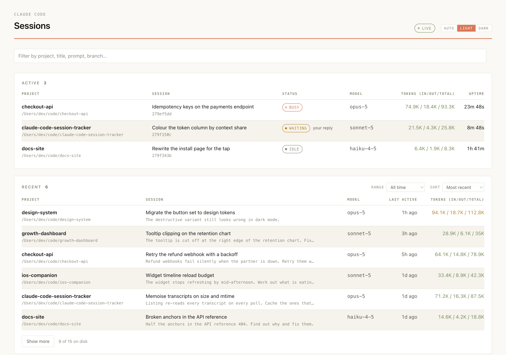
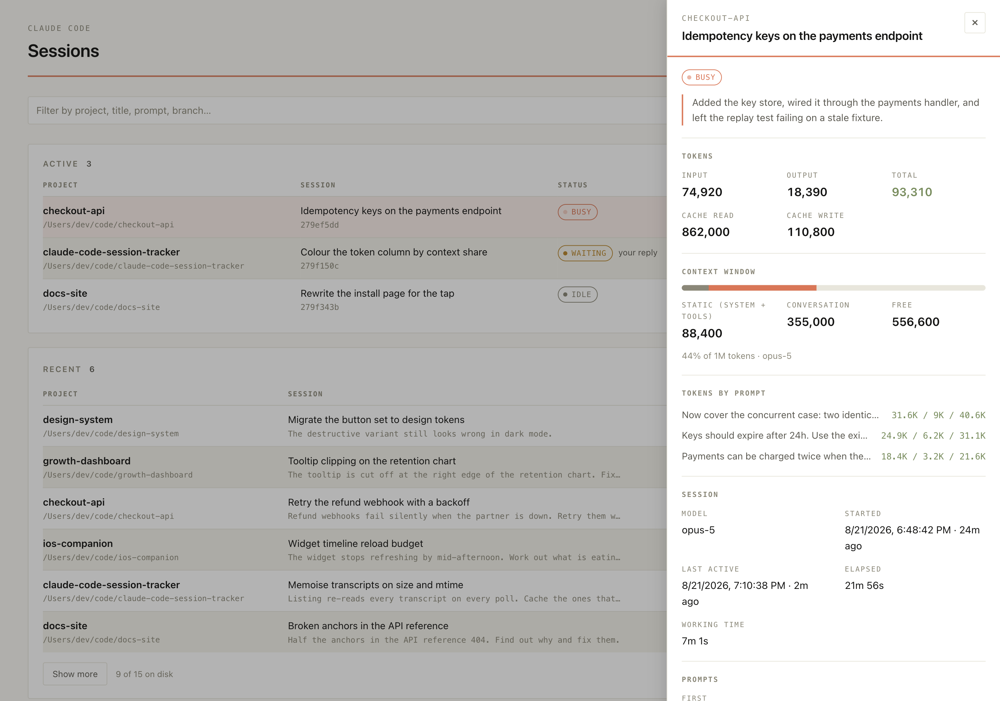
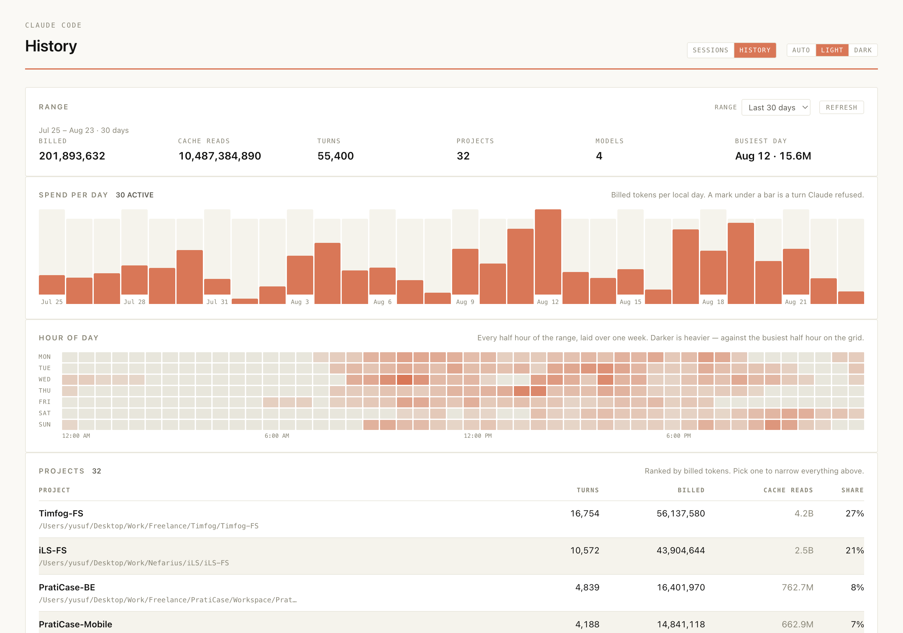
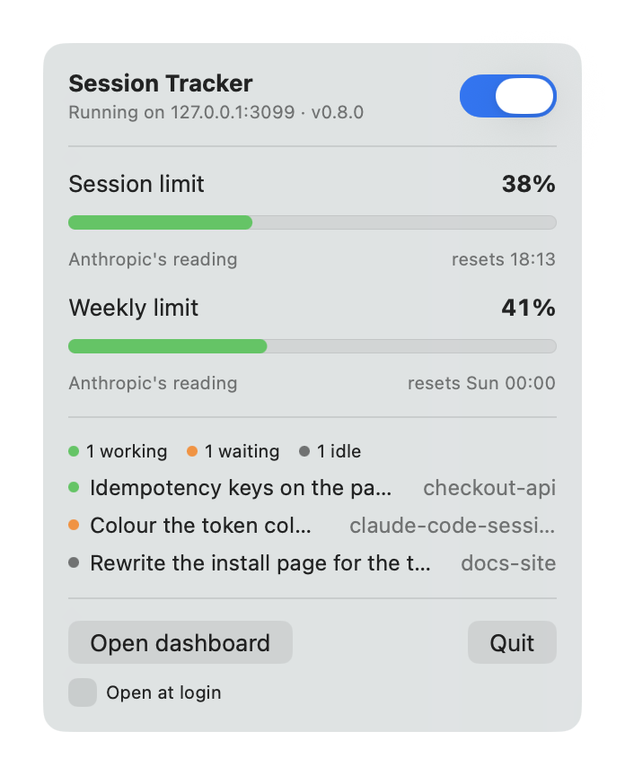
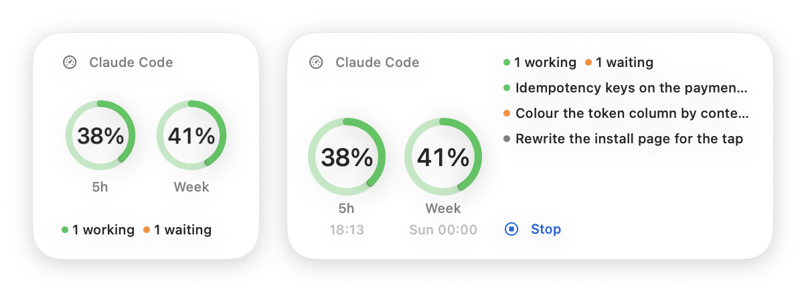

# Claude Code Session Tracker

[](https://github.com/meyusufdemirci/claude-code-session-tracker/actions/workflows/ci.yml)
[](https://www.npmjs.com/package/claude-code-session-tracker)
[](https://nodejs.org)
[](./LICENSE)

See every Claude Code session on your machine in a local dashboard — grouped by
project, with live status, titles, and token usage.

<picture>
  <source media="(prefers-color-scheme: dark)" srcset="docs/dashboard-dark.png" />
  
</picture>

```sh
npx claude-code-session-tracker
```

Then open the printed `http://127.0.0.1:3099`.

Run Claude Code in four terminals and you lose track of which one is waiting on
you, which is still working, and what you asked the one you abandoned yesterday.
Claude Code already writes all of that to `~/.claude`. This reads it — nothing
else — and puts it on one page.

## What you get

- ✅ **Your limits** — the five-hour and weekly windows: how full each is (the same
  percentage `/usage` shows), when it resets, and when it runs out at your current
  pace. [More](docs/limits.md)
- ✅ **A notification** when either window is on course to run out before it resets.
  Off until you turn it on. [More](docs/limits.md#getting-told)
- ✅ **Active sessions**, checked twice against the OS so a stale file or a recycled
  PID never shows up as running.
- ✅ **Recent sessions** across every project, with Claude's own title, the prompts,
  the model and the branch — filtered by date, sorted by recency or token spend.
  [More](docs/dashboard.md)
- ✅ **A detail panel** per session: message and tool-call counts, tokens, elapsed and
  working time, subagent count, and a copyable `claude --resume <id>`.
- ✅ **What the static context went on** — which `CLAUDE.md`, the skill listing, the
  agent listing, the MCP instructions — so the standing cost of every turn is
  itemised.
- ✅ **A history page**: where the tokens went by day, hour of day, calendar year,
  project and model, with PDF and `.xlsx` export and a year image to share.
  [More](docs/history.md)
- ✅ **Start at login** on macOS and Windows — [below](#start-it-at-login).
- ✅ **A menu bar switch and a widget** on macOS —
  [below](#menu-bar-and-widget-macos).
- ✅ **A Claude Code plugin**: `/session-tracker:status` and `/session-tracker:open` —
  [below](#inside-claude-code).
- ✅ **`--json`** for scripting, and an [HTTP API](docs/api.md).
- ✅ **No dependencies, no install scripts, no writes** to your Claude directory.

Click a row and the panel opens beside it:

<picture>
  <source media="(prefers-color-scheme: dark)" srcset="docs/session-detail-dark.png" />
  
</picture>

The history page:

<picture>
  <source media="(prefers-color-scheme: dark)" srcset="docs/history-dark.png" />
  
</picture>

## Install

Node 20 or newer, and Claude Code having run at least once. macOS, Linux and
Windows are all covered by CI.

```sh
npx      claude-code-session-tracker   # npm
pnpm dlx claude-code-session-tracker   # pnpm
yarn dlx claude-code-session-tracker   # yarn
bunx     claude-code-session-tracker   # bun
```

Or put it on your `PATH` — Homebrew brings its own Node:

```sh
brew install meyusufdemirci/tap/claude-code-session-tracker
npm i -g claude-code-session-tracker   # or pnpm add -g / bun add -g
```

## Start it at login

```sh
claude-code-session-tracker autostart on
```

macOS and Windows, no admin rights; `autostart off` undoes it. It needs an
installed copy (Homebrew or `npm i -g`), not `npx`. [Details](docs/autostart.md)

## Menu bar and widget (macOS)

A small native app whose switch turns the tracker on and off, with both limits and
the running sessions under it, plus a desktop widget showing the limits as rings.

```sh
npx claude-code-session-tracker menubar install --with-tracker
```

`--with-tracker` installs the tracker itself first; leave it off when it is already
installed. Needs macOS 14 or later. [Details](docs/menu-bar.md)

<p>
  <picture>
    <source media="(prefers-color-scheme: dark)" srcset="docs/menu-bar-dark.png" />
    
  </picture>
</p>

<picture>
  <source media="(prefers-color-scheme: dark)" srcset="docs/widget-dark.png" />
  
</picture>

## Inside Claude Code

```
/plugin marketplace add meyusufdemirci/claude-code-session-tracker
/plugin install session-tracker@claude-code-session-tracker
```

| Command | What it does |
| --- | --- |
| `/session-tracker:status` | Prints both limits and when they reset, what today has billed, and the sessions that are running |
| `/session-tracker:open` | Opens the page in your browser, starting the tracker first if it is not running |

The same two work in any terminal as `claude-code-session-tracker status` and
`open`. [Details](docs/plugin.md)

## Options

| Command | Description |
| --- | --- |
| `status` | Print both limits, what today has billed and the running sessions |
| `open` | Open the page, starting the tracker in the background first if needed |
| `autostart on\|off\|status` | Start at login (macOS and Windows) |
| `menubar install\|uninstall\|status` | The macOS menu bar app and widget; `install --with-tracker` installs the tracker too |

| Flag | Description |
| --- | --- |
| `-p, --port <number>` | Port to listen on, stepping forward up to 20 times if taken (default `3099`) |
| `--host <address>` | Address to bind (default `127.0.0.1` — see [Privacy](#privacy)) |
| `--no-open` | Do not open a browser |
| `--json` | Print the session list as JSON and exit |
| `-n, --limit <number>` | How many sessions to list (default `50`; running ones are always shown) |
| `--claude-dir <path>` | Override the Claude data directory (or set `CLAUDE_CONFIG_DIR`) |
| `--offline` | Never ask Anthropic's server for the usage limits |
| `-h, --help` | Show usage |
| `-v, --version` | Show the version |

`--json`, the HTTP API and the Node API are in [Scripting and API](docs/api.md).

## Privacy

The tool reads what Claude Code already writes to `~/.claude`, **never writes
there**, binds to loopback only, and rejects requests not addressed to a loopback
host. Its one outbound call is the usage endpoint Claude Code's own `/usage` reads,
at `api.anthropic.com`, with Claude Code's own token and at most every five
minutes; `--offline` turns it off. No telemetry, no update check.
[What it reads, and the rest](docs/privacy.md)

## More

- [The limits](docs/limits.md) — how the windows, the forecast and the notifications work
- [The history page](docs/history.md) — charts, export and sharing
- [The dashboard](docs/dashboard.md) — keys, range and sort
- [Scripting and API](docs/api.md)
- [Troubleshooting](docs/troubleshooting.md)
- [How it stays fast](docs/performance.md)
- [Development](docs/development.md) — building, testing and releasing

## Contributing

Issues and pull requests are welcome. `pnpm typecheck` and a passing `pnpm smoke`
against a fresh `npm pack` are what CI will ask of a change. A bug report that
includes your `GET /api/health` output and the `notes` from an affected session is
worth far more than a description.

## License

MIT © [Yusuf Demirci](https://github.com/meyusufdemirci)
